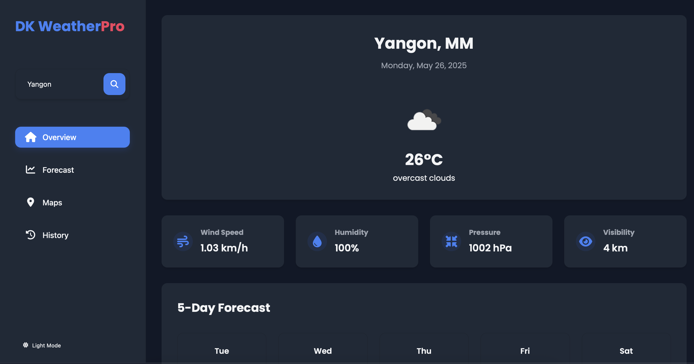
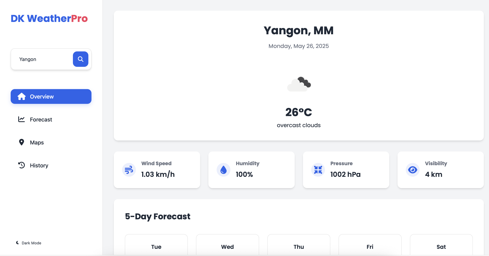

# DK WeatherPro - Weather Dashboard

A modern, responsive weather dashboard application that provides real-time weather information, forecasts, and interactive maps.

## 🌐 Live Demo

🔗 [View Website](https://waiyanphyooo21.github.io/waiyan-portfolio/)

## 📸 Screenshots

### 🌙 Dark Mode

### ☀️ Light Mode

## Features

- 🌡️ **Current Weather**

  - Temperature, humidity, pressure, and visibility
  - Weather conditions with icons
  - Wind speed information

- 📊 **5-Day Forecast**

  - Daily temperature predictions
  - Weather conditions
  - High and low temperatures

- 🗺️ **Interactive Maps**

  - Location-based weather visualization
  - Detailed weather popups
  - Easy navigation

- 📜 **Search History**

  - Track your recent searches
  - Quick access to previous locations
  - Clear history option

- 🎨 **Theme Support**
  - Light and dark mode
  - Persistent theme preference
  - Smooth transitions

## Technologies Used

- HTML5
- CSS3
- JavaScript (ES6+)
- OpenWeatherMap API
- Leaflet.js for maps
- Font Awesome icons
- Google Fonts

## Setup

1. Clone the repository
2. Get your API key from [OpenWeatherMap](https://openweathermap.org/api)
3. Replace the API key in the JavaScript files:
   - `js/script.js`
   - `js/forecast.js`
   - `js/maps.js`
   - `js/history.js`

## Usage

1. Enter a location in the search bar
2. View current weather conditions
3. Check the 5-day forecast
4. Explore the interactive map
5. Access your search history

## Features in Detail

### Current Weather

- Real-time temperature in Celsius
- Weather conditions with descriptive icons
- Wind speed in km/h
- Humidity percentage
- Atmospheric pressure
- Visibility in kilometers

### Forecast

- 5-day weather forecast
- Daily high and low temperatures
- Weather conditions for each day
- Visual weather icons

### Maps

- Interactive map view
- Location markers
- Weather information popups
- Easy navigation controls

### History

- Last 10 unique searches
- Quick search again option
- Clear history functionality
- Timestamp for each search

### Theme

- Toggle between light and dark modes
- Persistent theme preference
- Smooth theme transitions
- Consistent styling across all pages

## Browser Support

- Chrome (recommended)
- Firefox
- Safari
- Edge

## License

© 2025 DK WeatherPro. All rights reserved.

## Credits

- Weather data provided by [OpenWeatherMap](https://openweathermap.org)
- Maps powered by [OpenStreetMap](https://www.openstreetmap.org)
- Icons from [Font Awesome](https://fontawesome.com)
- Fonts from [Google Fonts](https://fonts.google.com)

## 📬 Contact

- Email: dm@waiyanphyooo.online
- GitHub: [@waiyanphyooo21](https://github.com/waiyanphyooo21)

## ⭐️ Show Your Support

If you like this project, consider giving it a ⭐️ on [GitHub](https://waiyanphyooo21.github.io/weather/)!
